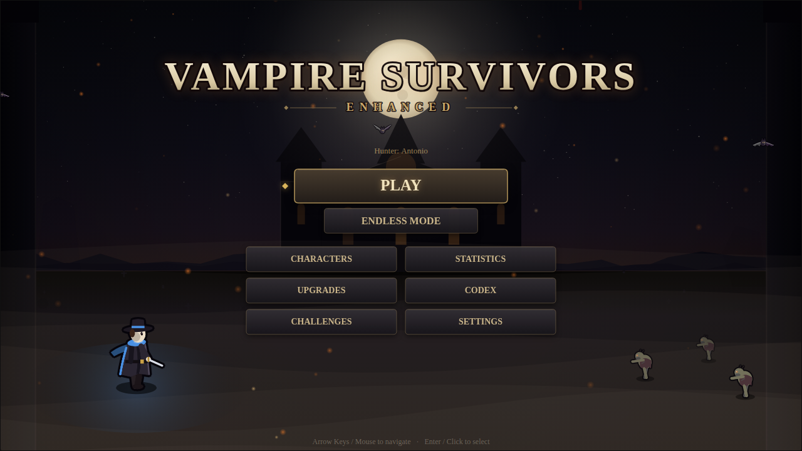
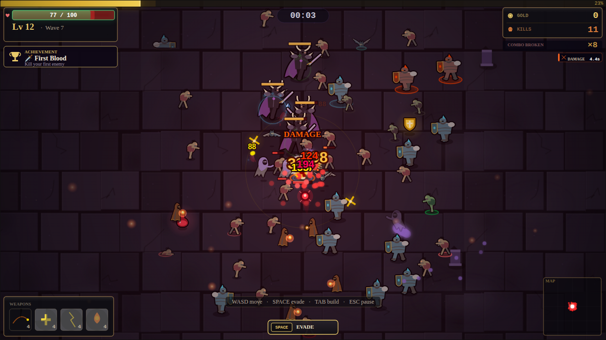

# 🧛 Vampire Survivors — Enhanced Edition

A gothic survival-action game for the browser, written in vanilla JavaScript and HTML5 Canvas. Your weapons fire on their own; your job is to move, pick your upgrades and survive the night.

### ▶ [Play it now — vampire-survivors-enhanced.vercel.app](https://vampire-survivors-enhanced.vercel.app/)

No install, no account. Desktop browser with a keyboard recommended.




## What's in the game

- **9 hunters**: Antonio, Imelda, Gennaro, Mortimer, Sera, Dante, Luna, Viktor and Nyx. Each has a starting weapon and stat bonuses; eight are unlocked by reaching milestones.
- **10 weapons**: Whip, Magic Missile, Throwing Knife, Lightning Chain, Garlic Aura, Holy Bible, Fire Wand, Bone Boomerang, Ice Shard and Shadow Dagger. Six slots per run, eight levels each.
- **10 evolutions**: a max-level weapon plus the right passive item evolves it (Bloody Tear, Soul Missile, Thousand Edge, Hellfire, Blizzard, Phantom Assassin and more).
- **6 passive items and 10 synergies**: weapon + passive pairs grant bonus effects.
- **10 creature types** that join the hunt over the first ten minutes: ghouls, blood bats, cultists, shield knights, wraiths, dreadlords, demons, werebeasts, necromancers and stone golems. Elites can carry auras.
- **3 bosses** arrive every five minutes (Vampire Lord, Lich King, Alpha Werewolf). Each has three phases and telegraphed attacks.
- **Timed events**: treasure chests, Golden Swarm, Blood Moon and the Calm Eye.
- **Relics** (short power-ups) drop mostly from elites: heal, invincibility, speed, damage, magnet and fire rate.
- **A 30-minute run**, after which Death comes for you. Endless Mode removes that limit.
- **Meta progression**: gold carries between runs into a permanent upgrade shop. There are also 12 achievements, 6 challenge modifiers for bonus gold, a codex/bestiary and lifetime statistics.
- **Procedural everything**: all art is drawn in code and baked into sprites, and all audio is synthesized with the Web Audio API. There are no image or sound files.

## Controls

| Key | Action |
| --- | --- |
| **WASD** / **Arrow keys** | Move |
| **Space** | Evade (short dash with brief immunity, 2.4s recharge) |
| **Shift** | Toggle manual aiming (aim with the mouse) |
| **Tab** | Inspect your build (weapons, passives, synergies, evolution progress) |
| **Esc** | Pause / resume |
| **1–5** or click | Pick a level-up option |
| **F1** | Settings |
| **F2** | Performance dashboard |
| **F4** / **G** | Debug overlay |

**Settings** include volume sliders, screen-shake intensity (0–100%), damage numbers, low-FX mode and an **Uncapped Frame Rate** option. By default, 120Hz+ displays render at a steady 60–72 FPS to save CPU; the option lifts that cap.

## Running it locally

The game uses ES modules, so it needs to be served over HTTP rather than opened as a file.

```bash
git clone https://github.com/BareTread/vampire-survivors-enhanced.git
cd vampire-survivors-enhanced
python -m http.server 8000     # or: npx serve .
```

Then open <http://localhost:8000>. There is no build step. After pulling changes, hard-refresh (Ctrl+Shift+R) so the browser drops cached modules.

### Tests

```bash
npm install
npm test -- --runInBand
```

The Jest suite (195 tests) covers balance, pacing, camera feel, pooling, audio routing and runtime regressions. `npm` is only needed for tests and linting; the game has no runtime dependencies.

## Project layout

```
index.html                 Entry page (loads src/vampireMain.js)
src/
├── vampireMain.js         Bootstrap: canvas, resize, game start
├── core/                  Game loop, camera, input, audio engine, terrain, sprites, pooling
├── systems/               Enemies, bosses, projectiles, XP, HUD, menus, events, persistence…
├── entities/
│   ├── Player.js, Enemy.js, Projectile.js, ExperienceGem.js
│   ├── enemies/           Wraith and Demon
│   ├── weapons/           The ten weapons (all extend BaseWeapon)
│   └── rendering/         Procedural art: hunters, creatures, bosses, relics
└── data/                  Character roster and creature names
tests/                     Jest suites
```

`CLAUDE.md` is the detailed developer guide: architecture, conventions for adding weapons and enemies, and a dated log of every major change.

## Performance notes

- Rendering bakes anything static (floor tiles, lighting, vignette, HUD panels, sprites) and blits it, culls enemies to the viewport, and avoids `shadowBlur` and full-screen gradients in the frame loop.
- In the heaviest scene tested (about 130 enemies at 1280×720, software rendering) the game holds 60 FPS.
- Particles, projectiles, gems and enemies are pooled. A 5-minute soak test showed flat memory.

## Built with

Vanilla JavaScript (ES modules), HTML5 Canvas 2D and the Web Audio API. Tests use Jest.

---

**🧛 Survive the night. 🌙**
